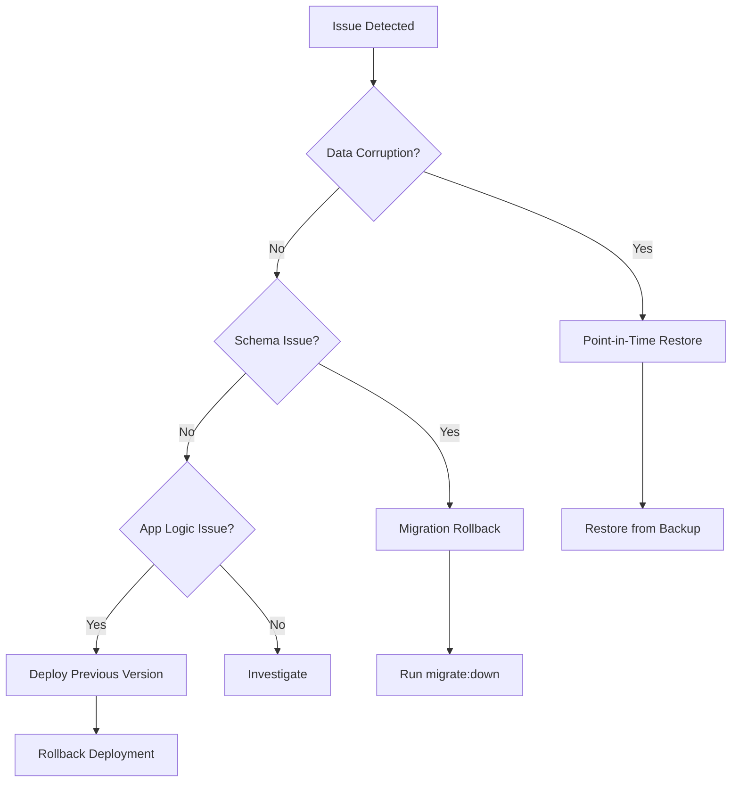

# ADR-012: Database Migration Rollback

**Status**: Accepted
**Date**: 2026-01-25
**Deciders**: Development Team
**Tags**: database, infrastructure, devopsary 25, 2026 (Full Implementation)

> **Related Roadmap Item**: Infrastructure & DevOps - Database Migration Rollback

---

## Executive Summary

This plan outlines a comprehensive strategy for safely rolling back database migrations in OrgTree. The goal is to ensure that schema changes and data migrations can be safely reverted when issues are discovered post-deployment, minimizing downtime and data loss.

---

## 1. Current Architecture Analysis

### 1.1 Database Technology

OrgTree uses **SQLite** with the following configuration:

| Aspect           | Configuration                                               |
| ---------------- | ----------------------------------------------------------- |
| **Engine**       | better-sqlite3                                              |
| **Journal Mode** | WAL (Write-Ahead Logging)                                   |
| **Location**     | `server/database.db` or `DATABASE_URL` environment variable |
| **Concurrency**  | `busy_timeout = 5000ms`                                     |
| **Foreign Keys** | Enabled                                                     |

### 1.2 Current Migration System

Migrations are currently implemented as **inline startup checks** in [db.ts](file:///Users/ojdavis/Claude%20Code/OrgTree/server/src/db.ts):

```typescript

// Example: Current migration pattern in db.ts
try {
  const tableInfo = db.prepare('PRAGMA table_info(users)').all();
  const columnNames = tableInfo.map(col => col.name);

  if (!columnNames.includes('is_discoverable')) {
    db.exec('ALTER TABLE users ADD COLUMN is_discoverable BOOLEAN DEFAULT 1');
    console.log('Migration: Added is_discoverable column to users table');
  }
} catch (err) {
  console.error('Migration error:', err);
}

```

**Current Migration Types in db.ts**:

- Column additions (`ALTER TABLE ... ADD COLUMN`)
- Table creations (`CREATE TABLE IF NOT EXISTS`)
- Index creations (`CREATE INDEX IF NOT EXISTS`)
- FTS5 virtual table and trigger management
- Complex table reconstructions (SQLite doesn't support `DROP COLUMN`)

### 1.3 Existing Backup System

OrgTree already has a robust backup system in place:

| Component            | Location                                                                                               | Purpose                        |
| -------------------- | ------------------------------------------------------------------------------------------------------ | ------------------------------ |
| **Backup Service**   | [backup.service.ts](file:///Users/ojdavis/Claude%20Code/OrgTree/server/src/services/backup.service.ts) | Core backup/restore logic      |
| **Backup Script**    | [backup.ts](file:///Users/ojdavis/Claude%20Code/OrgTree/server/scripts/backup.ts)                      | CLI tool for backup operations |
| **Retention Policy** | `BACKUP_RETENTION` env var                                                                             | Default: 7 backups             |
| **Backup Directory** | `BACKUP_DIR` env var                                                                                   | Default: `./backups`           |

**Existing Functions**:

- `createBackup(customPath?)` - Creates SQLite snapshot
- `listBackups()` - Lists all backups with metadata
- `cleanupOldBackups(keepCount)` - Retention cleanup
- `restoreFromBackup(backupPath)` - Full database restore
- `getBackupStats()` - Backup statistics

### 1.4 CI/CD Pipeline

| Branch    | Environment | Trigger                   | URL                                  |
| --------- | ----------- | ------------------------- | ------------------------------------ |
| `develop` | Staging     | CI success + workflow_run | <https://orgtree-staging.onrender.com> |
| `main`    | Production  | CI success + workflow_run | <https://orgtree-app.onrender.com>     |

---

## 2. Gap Analysis

### 2.1 Current Limitations
>
> [!CAUTION]
> **Critical Gap**: No mechanism exists to revert schema changes once applied. Migrations are forward-only.

| Gap                                 | Impact                                    | Priority  |
| ----------------------------------- | ----------------------------------------- | --------- |
| No versioned migrations             | Cannot track which migrations have run    | 🔴 HIGH   |
| No down migrations                  | Cannot undo schema changes                | 🔴 HIGH   |
| No pre-deployment backup automation | Risk of data loss on failed deploy        | 🔴 HIGH   |
| Inline migrations in `db.ts`        | Hard to test, version, and audit          | 🟡 MEDIUM |
| No migration state tracking         | Can't determine current schema version    | 🟡 MEDIUM |
| No dry-run capability               | Can't validate migrations before applying | 🟠 LOW    |

### 2.2 SQLite-Specific Constraints

SQLite has limited schema alteration capabilities:

| Operation        | SQLite Support   | Workaround                                     |
| ---------------- | ---------------- | ---------------------------------------------- |
| `ADD COLUMN`     | ✅ Supported     | Direct                                         |
| `DROP COLUMN`    | ❌ Not supported | Table reconstruction                           |
| `RENAME COLUMN`  | ⚠️ Limited       | `ALTER TABLE ... RENAME COLUMN` (SQLite 3.25+) |
| `MODIFY COLUMN`  | ❌ Not supported | Table reconstruction                           |
| `ADD CONSTRAINT` | ❌ Not supported | Table reconstruction                           |

---

## 3. Proposed Solution

### Phase 1: Pre-Deployment Backup Automation (Week 1)

#### 3.1.1 Auto-Backup Before Migrations

Add automatic backup creation before any migration runs:

```typescript

// server/src/services/migration-backup.service.ts [NEW]

export async function createPreMigrationBackup(): Promise<string> {
  const timestamp = new Date().toISOString().replace(/[:.]/g, '-');
  const backupPath = path.join(BACKUP_DIR, `pre-migration-${timestamp}.db`);
  await createBackup(backupPath);
  return backupPath;
}

```

#### 3.1.2 GitHub Actions Pre-Deploy Backup

Modify [cd.yml](file:///Users/ojdavis/Claude%20Code/OrgTree/.github/workflows/cd.yml) to create backups before deployments:

```yaml

- name: Create pre-deployment backup
  run: |
    curl -X POST "https://orgtree-app.onrender.com/api/admin/backup" \
      -H "Authorization: Bearer ${{ secrets.BACKUP_API_TOKEN }}" \
      -H "Content-Type: application/json" \
      -d '{"type": "pre-deployment"}'

```

---

### Phase 2: Migration Version Tracking (Week 2)

#### 3.2.1 Create Migrations Table

Track applied migrations with a dedicated table:

```sql

CREATE TABLE IF NOT EXISTS _migrations (
  id INTEGER PRIMARY KEY AUTOINCREMENT,
  version TEXT NOT NULL UNIQUE,
  name TEXT NOT NULL,
  applied_at DATETIME DEFAULT CURRENT_TIMESTAMP,
  checksum TEXT,
  rollback_sql TEXT
);

```

#### 3.2.2 Migration File Structure

Migrate from inline code to versioned migration files:

```texttext

server/
└── migrations/
    ├── 001_initial_schema.ts
    ├── 002_add_sharing_columns.ts
    ├── 003_add_organization_members.ts
    └── ...

```

Each migration file exports `up()` and `down()` functions:

```typescript

// server/migrations/004_add_is_discoverable.ts

export const version = '004';
export const name = 'add_is_discoverable';

export function up(db: Database) {
  db.exec('ALTER TABLE users ADD COLUMN is_discoverable BOOLEAN DEFAULT 1');
}

export function down(db: Database) {
  // SQLite requires table reconstruction for DROP COLUMN
  db.exec(`
    BEGIN TRANSACTION;
    CREATE TABLE users_new AS 
      SELECT id, email, password_hash, name, role, ... 
      FROM users;
    DROP TABLE users;
    ALTER TABLE users_new RENAME TO users;
    COMMIT;
  `);
}

export const rollbackSQL = `
  CREATE TABLE users_new AS SELECT ... FROM users;
  DROP TABLE users;
  ALTER TABLE users_new RENAME TO users;
`;

```

---

### Phase 3: Migration Runner Service (Week 2-3)

#### 3.3.1 Migration Runner

Create a migration runner that handles up/down migrations:

```typescript

// server/src/services/migration-runner.service.ts [NEW]

interface MigrationFile {
  version: string;
  name: string;
  up: (db: Database) => void;
  down: (db: Database) => void;
  rollbackSQL?: string;
}

export async function runMigrations(direction: 'up' | 'down' = 'up') {
  const appliedMigrations = getAppliedMigrations();
  const migrationFiles = loadMigrationFiles();

  if (direction === 'up') {
    for (const migration of migrationFiles) {
      if (!appliedMigrations.includes(migration.version)) {
        await runMigration(migration, 'up');
      }
    }
  } else {
    // Rollback most recent migration
    const lastMigration = appliedMigrations[appliedMigrations.length - 1];
    const migration = migrationFiles.find(m => m.version === lastMigration);
    if (migration) {
      await runMigration(migration, 'down');
    }
  }
}

```

#### 3.3.2 CLI Commands

Add migration CLI commands to `package.json`:

```json

{
  "scripts": {
    "migrate": "tsx scripts/migrate.ts up",
    "migrate:down": "tsx scripts/migrate.ts down",
    "migrate:status": "tsx scripts/migrate.ts status",
    "migrate:create": "tsx scripts/migrate.ts create"
  }
}

```

---

### Phase 4: Rollback Procedures (Week 3)

#### 3.4.1 Rollback Strategies

Define three rollback strategies based on severity:

| Strategy                  | Use Case             | Recovery Time | Data Impact            |
| ------------------------- | -------------------- | ------------- | ---------------------- |
| **Migration Rollback**    | Schema issue only    | < 1 minute    | None                   |
| **Point-in-Time Restore** | Data corruption      | 2-5 minutes   | Loss since backup      |
| **Full Restore**          | Catastrophic failure | 5-10 minutes  | Full restore to backup |

#### 3.4.2 Rollback Decision Tree



#### 3.4.3 Automated Rollback Script

```bash

#!/bin/bash
# server/scripts/rollback.sh

case "$1" in
  "migration")
    npm run migrate:down
    ;;
  "backup")
    BACKUP_FILE="${2:-$(ls -t backups/*.db | head -1)}"
    npm run backup:restore "$BACKUP_FILE"
    ;;
  "full")
    # Stop server, restore, restart
    pm2 stop orgtree
    npm run backup:restore "$2"
    pm2 start orgtree
    ;;
  *)
    echo "Usage: ./rollback.sh [migration|backup|full] [backup-file]"
    ;;
esac

```

---

### Phase 5: CD Pipeline Integration (Week 4)

#### 3.5.1 Enhanced CD Workflow

Update [cd.yml](file:///Users/ojdavis/Claude%20Code/OrgTree/.github/workflows/cd.yml) with rollback capabilities:

```yaml

deploy-production:
  steps:
    - name: Create pre-deployment backup
      id: backup
      run: |
        BACKUP_ID=$(curl -s -X POST "${{ secrets.BACKUP_API_URL }}" \
          -H "Authorization: Bearer ${{ secrets.API_TOKEN }}" | jq -r '.backupId')
        echo "backup_id=$BACKUP_ID" >> $GITHUB_OUTPUT

    - name: Run migrations
      id: migrate
      run: |
        curl -X POST "${{ secrets.MIGRATE_API_URL }}" \
          -H "Authorization: Bearer ${{ secrets.API_TOKEN }}"
      continue-on-error: true

    - name: Rollback on failure
      if: steps.migrate.outcome == 'failure'
      run: |
        curl -X POST "${{ secrets.ROLLBACK_API_URL }}" \
          -H "Authorization: Bearer ${{ secrets.API_TOKEN }}" \
          -d '{"backupId": "${{ steps.backup.outputs.backup_id }}"}'

```

#### 3.5.2 Health Check with Migration Verification

```yaml

- name: Verify migrations
  run: |
    MIGRATION_STATUS=$(curl -s "$HEALTH_URL/api/migrations/status")
    PENDING=$(echo "$MIGRATION_STATUS" | jq -r '.pending')

    if [ "$PENDING" != "0" ]; then
      echo "❌ Migrations failed - $PENDING pending"
      exit 1
    fi

```

---

## 4. Implementation Details

### 4.1 New Files to Create

| File                                              | Purpose                         |
| ------------------------------------------------- | ------------------------------- |
| `server/src/services/migration-runner.service.ts` | Core migration logic            |
| `server/src/services/migration-backup.service.ts` | Pre-migration backup automation |
| `server/src/routes/migrations.ts`                 | Migration API endpoints         |
| `server/scripts/migrate.ts`                       | CLI migration tool              |
| `server/scripts/rollback.sh`                      | Rollback shell script           |
| `server/migrations/`                              | Directory for migration files   |

### 4.2 Files to Modify

| File                                                                                                   | Changes                                             |
| ------------------------------------------------------------------------------------------------------ | --------------------------------------------------- |
| [db.ts](file:///Users/ojdavis/Claude%20Code/OrgTree/server/src/db.ts)                                  | Add `_migrations` table, refactor inline migrations |
| [cd.yml](file:///Users/ojdavis/Claude%20Code/OrgTree/.github/workflows/cd.yml)                         | Add pre-deploy backup and rollback steps            |
| [backup.service.ts](file:///Users/ojdavis/Claude%20Code/OrgTree/server/src/services/backup.service.ts) | Add pre-migration backup tagging                    |
| `package.json`                                                                                         | Add migration CLI scripts                           |

### 4.3 API Endpoints

| Endpoint                         | Method | Purpose                         |
| -------------------------------- | ------ | ------------------------------- |
| `/api/admin/migrations`          | GET    | List migrations and status      |
| `/api/admin/migrations/run`      | POST   | Run pending migrations          |
| `/api/admin/migrations/rollback` | POST   | Rollback last migration         |
| `/api/admin/backup/pre-deploy`   | POST   | Create tagged pre-deploy backup |

---

## 5. Rollback Runbook

### 5.1 Migration Rollback Procedure

**When to Use**: Schema change caused issues, data is intact

```bash

# 1. Check current migration status
npm run migrate:status

# 2. Rollback the last migration
npm run migrate:down

# 3. Verify rollback
npm run migrate:status

# 4. Restart application
pm2 restart orgtree

```

### 5.2 Backup Restore Procedure

**When to Use**: Data corruption detected

```bash

# 1. List available backups
npm run backup:list

# 2. Create a backup of current (corrupted) state for analysis
npm run backup -- --prefix corrupted

# 3. Restore from last known good backup
npm run backup:restore orgtree-backup-2026-01-25-020000.db

# 4. Restart application
pm2 restart orgtree

# 5. Notify users of potential data loss window

```

### 5.3 Emergency Full Rollback

**When to Use**: Catastrophic failure, production is down

```bash

# 1. Stop all traffic (if using load balancer)
# 2. Stop application
pm2 stop orgtree

# 3. Restore database
npm run backup:restore <most-recent-good-backup>

# 4. Deploy previous application version
git checkout <previous-tag>
npm run build
pm2 start orgtree

# 5. Verify health
curl https://orgtree-app.onrender.com/api/health

```

---

## 6. Verification Plan

### 6.1 Automated Tests

```typescript

// server/src/services/migration-runner.service.test.ts

describe('Migration Runner', () => {
  it('should run pending migrations in order');
  it('should skip already-applied migrations');
  it('should create backup before migration');
  it('should rollback on failure');
  it('should track migration state correctly');
  it('should handle down migration for complex schemas');
});

```

### 6.2 Manual Verification

1. **Happy Path**: Apply migration, verify schema, rollback, verify reverted
2. **Failure Scenario**: Introduce failing migration, verify auto-rollback
3. **Backup Integration**: Verify pre-deploy backups are created and tagged
4. **CI/CD Integration**: Deploy to staging with migration, trigger rollback

---

## 7. Timeline

| Phase                            | Duration  | Deliverables                                  |
| -------------------------------- | --------- | --------------------------------------------- |
| **Phase 1**: Pre-Deploy Backup   | 1 week    | Auto-backup before migrations, CD integration |
| **Phase 2**: Version Tracking    | 1 week    | `_migrations` table, migration file structure |
| **Phase 3**: Migration Runner    | 1-2 weeks | Migration service, CLI tools, up/down logic   |
| **Phase 4**: Rollback Procedures | 1 week    | Runbooks, rollback scripts, decision tree     |
| **Phase 5**: CD Integration      | 1 week    | Enhanced CI/CD, health checks, auto-rollback  |

**Total Estimated Duration**: 4-6 weeks

---

## 8. Success Metrics

| Metric                       | Current            | Target          |
| ---------------------------- | ------------------ | --------------- |
| Migration rollback time      | N/A (not possible) | < 2 minutes     |
| Pre-deploy backup coverage   | 0%                 | 100%            |
| Migration tracking           | None               | Fully versioned |
| Rollback test frequency      | Never              | Monthly         |
| Mean time to recovery (MTTR) | Unknown            | < 10 minutes    |

---

## 9. Dependencies & Prerequisites

- ✅ Backup service already implemented
- ✅ SQLite WAL mode for concurrent access
- ✅ Create migration CLI scripts
- ✅ Set up `_migrations` table
- ✅ Refactor inline migrations to versioned files
- ✅ Add CD pipeline backup step
- ✅ Create rollback runbooks

---

## 10. Risks & Mitigations

| Risk                           | Impact                            | Mitigation                        |
| ------------------------------ | --------------------------------- | --------------------------------- |
| SQLite's limited ALTER TABLE   | Complex rollback for column drops | Document reconstruction patterns  |
| Missing migration dependencies | Failed rollbacks                  | Test migrations in staging first  |
| Backup storage limits          | Can't keep all backups            | Implement tiered retention policy |
| Production data loss           | Business critical                 | Always backup before migration    |

---

## 11. References

- [SQLite ALTER TABLE limitations](https://www.sqlite.org/lang_altertable.html)
- [better-sqlite3 Backup API](https://github.com/WiseLibs/better-sqlite3/blob/master/docs/api.md#backupdestination-options---promise)
- [ADR-001: SQLite as Primary Database](file:///Users/ojdavis/Claude%20Code/OrgTree/docs/adr/001-sqlite-as-primary-database.md)
- [OrgTree Deployment Guide](file:///Users/ojdavis/Claude%20Code/OrgTree/docs/DEPLOYMENT.md)

---

## Appendix A: Migration Template

```typescript

// server/migrations/XXX_migration_name.ts

import type { Database } from 'better-sqlite3';

export const version = 'XXX';
export const name = 'migration_name';
export const description = 'Brief description of what this migration does';

/**
 * Apply the migration
 */
export function up(db: Database): void {
  db.exec(`
    -- Migration SQL here
  `);
}

/**
 * Rollback the migration
 */
export function down(db: Database): void {
  db.exec(`
    -- Rollback SQL here
  `);
}

/**
 * Raw SQL for emergency manual rollback
 */
export const rollbackSQL = `
  -- Manual rollback SQL for emergency use
`;

```

---

## Appendix B: Table Reconstruction Pattern

Since SQLite doesn't support `DROP COLUMN`, use this pattern:

```sql

-- 1. Begin transaction for atomicity
BEGIN TRANSACTION;

-- 2. Create new table without the column
CREATE TABLE table_new (
  id TEXT PRIMARY KEY,
  -- List columns WITHOUT the one to drop
  name TEXT NOT NULL,
  created_at DATETIME DEFAULT CURRENT_TIMESTAMP
);

-- 3. Copy data
INSERT INTO table_new (id, name, created_at)
SELECT id, name, created_at FROM table_original;

-- 4. Drop original table
DROP TABLE table_original;

-- 5. Rename new table
ALTER TABLE table_new RENAME TO table_original;

-- 6. Recreate indexes
CREATE INDEX idx_table_name ON table_original(name);

-- 7. Commit transaction
COMMIT;

```
>
> [!WARNING]
> Table reconstruction locks the table and can be slow for large tables. Schedule during low-traffic periods.

---

## Appendix C: Rollback Checklist

- [ ] Identify the issue and determine rollback strategy
- [ ] Notify stakeholders of impending rollback
- [ ] Create backup of current state (for forensics)
- [ ] Execute rollback procedure
- [ ] Verify database integrity (`PRAGMA integrity_check`)
- [ ] Verify FTS indexes (`/api/search/health`)
- [ ] Run health check (`/api/health`)
- [ ] Test critical user flows
- [ ] Document incident for post-mortem
- [ ] Notify stakeholders of completion
